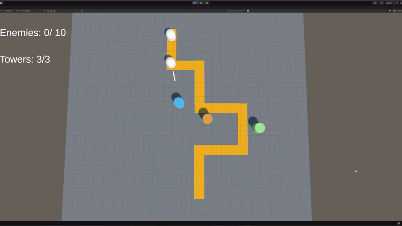

# Tower Defense Game - Technical Documentation

## Overview
A 3D tower defense game built with Unity, featuring modular tower placement, enemy waves, and state-driven gameplay. Utilizes VContainer for dependency injection and follows SOLID principles for scalable architecture.
## Key Features
- **Tower System**: 3 tower types (Basic/Slow/Fast) with configurable stats
- **Wave System**: ScriptableObject-based enemy wave configurations
- **State Management**: Building & Combat phases with GameStateMachine
- **Dependency Injection**: Managed via VContainer
- **Object Pooling**: Optimized enemy spawning

---

## Project Structure

### 1. Core Gameplay
| Component               | Responsibility                         |
|-------------------------|----------------------------------------|
| `TowerPlacementController` | Handles tower placement logic and input |
| `GameConfig`            | Contains runtime game data and settings |
| `UIController`          | Manages UI interactions      |

### 2. Tower System
| Component         | Role                                      |
|-------------------|-------------------------------------------|
| `Tower`           | Base tower class with targeting logic     |
| `TowerFactory`    | Creates towers using DI                   |
| `TowerConfig`     | ScriptableObject for tower configurations |

### 3. Enemy System
| Component         | Functionality                             |
|-------------------|-------------------------------------------|
| `EnemySpawner`    | Manages wave-based enemy spawning         |
| `EnemyFactory`    | Pooled enemy creation system              |
| `IEnemy`          | Enemy behavior contract                   |

### 4. Game State Management
| Component          | Description                              |
|--------------------|------------------------------------------|
| `GameStateMachine` | Controls state transitions               |
| `BuildingState`    | Tower placement phase                    |
| `CombatState`      | Enemy spawning/combat phase              |

### 5. Dependency Injection
| Component      | Usage                                    |
|----------------|------------------------------------------|
| `GameLifetime` | VContainer configuration scope           |
           |

---

## How It Works

### Core Game Loop
1. **Building Phase**:
    - **Player places towers using numeric keys (1-3)**
    - Tower placement validates path collision
    - Limited by `maxTowerCount`

2. **Combat Phase**:
    - Enemy waves spawn following `WaveConfig`
    - Towers automatically target nearest enemies
    - Bullet physics with configurable speed/damage

3. **State Transition**:
   ```csharp
   // Example state change
   gameStateMachine.ChangeState(GameStateType.Combat);
   ```

### Tower Mechanics
- **Targeting**: SphereCast with priority to nearest enemy
- **Attack**: Bullet instantiation with physics
- **Config**: Stats controlled via ScriptableObjects

### Enemy System
- **Pooling**: ObjectPool optimizes instantiation
- **Path Following**: Uses predefined `Path` points
- **Wave Progression**: Configurable spawn intervals

---

## VContainer Integration

### Configuration (GameLifetime.cs)
```csharp
protected override void Configure(IContainerBuilder builder)
{
    // Component registration
    builder.RegisterComponent(enemySpawner);
    builder.Register<EnemyFactory>(Lifetime.Singleton).As<IEnemyFactory>();
    
    // State management
    builder.Register<BuildingState>(Lifetime.Singleton);
    builder.Register<CombatState>(Lifetime.Singleton);
    
    // Configurations
    builder.RegisterInstance(gameConfig);
}
```

### Dependency Injection Patterns
1. **Constructor Injection**:
   ```csharp
   [Inject]
   public CombatState(EnemySpawner spawner) { ... }
   ```

2. **Property Injection**:
   ```csharp
   [Inject]
   public void Construct(ITowerFactory factory, GameConfig config) { ... }
   ```

3. **Interface Binding**:
   ```csharp
   builder.Register<TowerFactory>().As<ITowerFactory>();
   ```

---

## Optimization Features

1. **Object Pooling**:
    - EnemyFactory uses `ObjectPool<GameObject>`
    - Recycles enemies instead of Destroy/Instantiate

2. **Efficient Physics**:
    - `OverlapSphereNonAlloc` in tower targeting
    - `OverlapBox` for path collision checks

3. **ScriptableObject Configs**:
    - Centralized tower/wave configurations
    - Runtime data separation in GameConfig

---

## Setup Instructions

1. **VContainer Installation**:
   ```bash
   Install via Package Manager: https://vcontainer.hadashikick.jp/
   ```

2. **Asset Configuration**:
    - Create TowerConfig/WaveConfig assets
    - Set up Path points in scene

3. **Scene Setup**:
    - Add GameLifetimeScope prefab
    - Configure EnemySpawner and Path references
    - Set up UI Canvas with UIController

4. **Layer Configuration**:
    - Create "Ground" and "Path" layers
    - Configure collision matrices

---

## Architecture Diagram

```
[GameStateMachine]
       │
       ├── BuildingState → TowerPlacementController
       │
       └── CombatState → EnemySpawner
               │
               └── EnemyFactory → ObjectPool
                       │
                       └── IEnemy Implementations

[TowerSystem]
       │
       ├── TowerFactory → TowerConfig
       │
       └── Tower → Bullet Physics
```

This architecture enables easy extension through:
- New tower types via TowerConfig
- Additional game states through IGameState
- Custom enemy behaviors via IEnemy
- Modular UI components through GameConfig events

